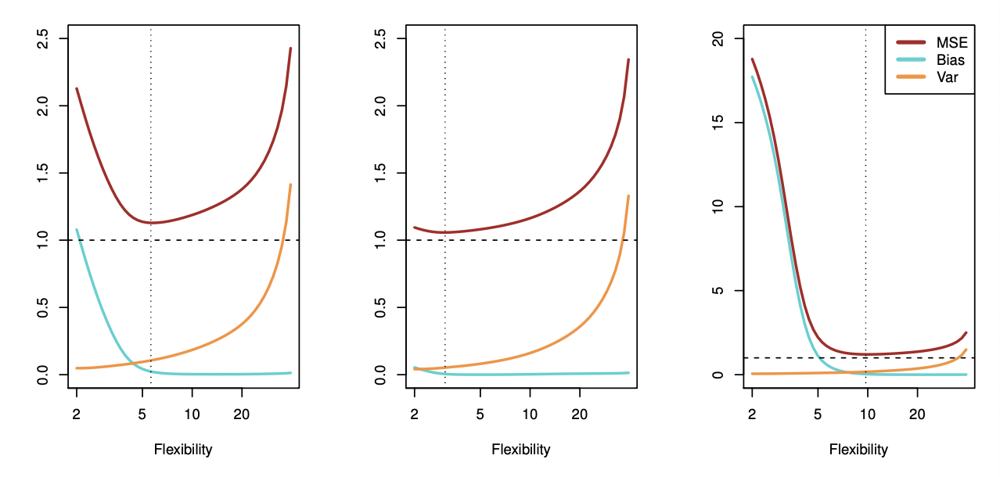
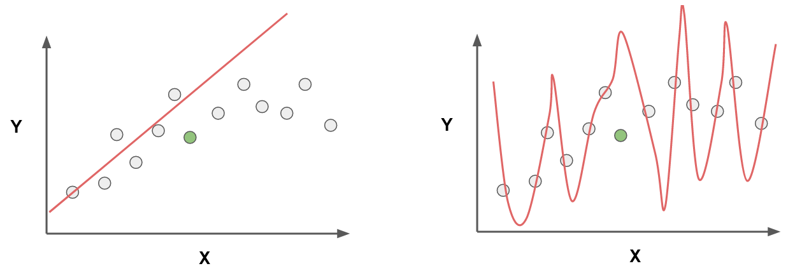
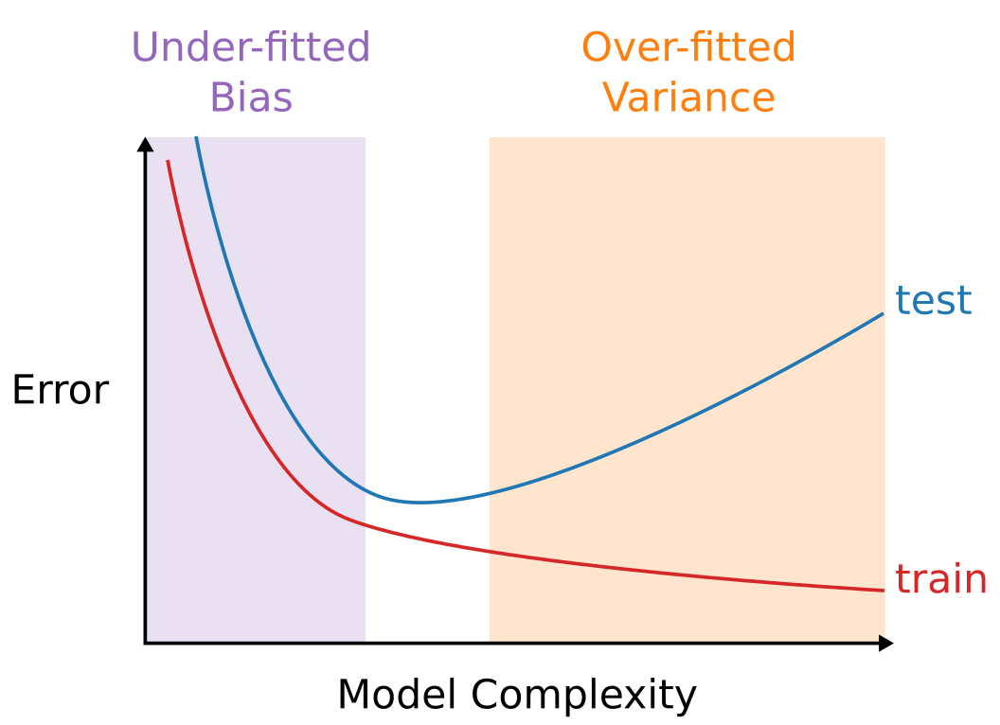

# Bias-Variance Trade-Off

The accuracy of a machine learning algorithm is often evaluated by the value of the mean square error (MSE)

$$ MSE = \frac{1}{n} \sum_{i=1}^{n}(y_i - \hat y_i)^2 $$

It can be shown mathematically that this error is made up by the variance and bias of the prediction $y$ (plus the variance of the irreducible error)

$$ E[MSE] = Var(\hat y) +[Bias(\hat y)] + Var(\epsilon)$$

  

The figure above shows how the bias increases with degrees of complexity (model flexibility), the variance decreases with degrees of complexity, and how the MSE is the sum of the Bias (blue), Variance (orange) and irreducible error (dashed)

### Variance
The variance of a statistical learning method refers to the amount by which the prediction $\hat y$ would change if it was estimated using a different training data set. 

When solving a statistical learning model, the prediction $\hat y$ (ideally) does not change much when using different training data set $X_{train}$; The more the prediction $\hat y$ changes, the larger the variance of the model. 

### Bias

The bias of a statistical learning method refers to the error which is introduced when approximating a real-life problem by a relatively simple model. 

If a quadratic relationship is modeled by a simple linear model, there will always be a significant error due to the chosen model. It all depends on the true relationship. 

## Underfitting & Overfitting
When choosing a model there is always a trade-off between underfitting and overfitting. If the model is too generalized, it will not accurately reflect the underlying data, and future predictions will be way off. If the model is trained too hard onto the training data, it will pass exactly through all points, but will not be able to make accurate predictions. 

If the model is *underfitted* (left) there is a large **bias**  
if the model is *overfitted* (right) there is a large **variance**

  

## Model Complexity
In order to determine the right balance between these two, the model's complexity is compared to the resulting error. In general the error of the predictions of the training data will go down with model complexity until the model goes exactly through each data point. The error of the predictions of the test data on the other hand will increase again.

  

The level of complexity should be chosen based on the lowest error of both the test & training data.

## Overview

|Bias|Variance|
|--|--|
|Under-fitted|Over-fitted|
|Inflexible| flexible|
|changing $X$ changes $\hat y$ significantly|changing $X$ changes $\hat y$ insignificantly|