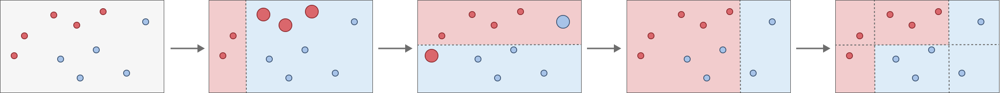

# Boosting

Similar to bagging, boosting is a general approach that may be applied to various statistical models for both classification and regression. 

Bagging and random forest methods utilize many different versions of the same data set, sampled in different ways, where trees of similar complexity fitted on these subsets of the dataset are combined in order to give the final prediction. 

The boosting method does not use subsets, but utilizes the entire data set. It combines trees of increasing complexity until the desired degree of accuracy is obtained. 

## Adaptive Boosting
Adaptive Boosting (AdaBoosting) is a meta-model. It uses a series of weak learners (simplistic models) and combines them through a weighted sum. Each new model in the sum is based on the previous tree in the sum, making the model “adaptive”. 

### Algorithm
A set of predictions $y$ can be approximated using a very simple model $\hat h_0$, which will result in a set of residuals $r_0$ 

$$ y \approx \hat h_0 + r_0$$

An additional model $\hat h_1$ can be introduced which aims to improve the total predictions, where the parameter $\lambda_1$ is chosen such that the new residuals $r_1$ are minimized. 

$$ y \approx \hat h_0 + \lambda_1 \hat h_1 + r_1 $$

The final predictor $\hat y_m$ is thus a linear sum of weak learners consisting of $m$ sub-models

$$ \hat y_m = \sum_{n=1}^{m} \lambda_n \hat h_n $$

The parameter $\lambda_n$ is chosen such that the error of the weak learner $\hat h_n$ is minimized. This is done by assigning weights to the misclassified data points, and fits the next weak learner on this. 

  

The complexity of each weak learner $\hat h$ can be controlled. For tree based methods this parameter is $d$ and controls the number of splits ($d$ + 1 leaf nodes). This controls the interaction depth of the model. Often $d$ = 1 will work just fine, which is simple a tree stump (one root node and two leaf nodes). 

### Loss Function - Classification

When training the next model in the linear combination the previous linear combination is taken and an additional weak learner is added

$$ \hat y_m = \hat y_{m-1} + \lambda_m \hat h_m $$

<!-- $$ \hat y_{m-1} = \sum_{n=1}^{m-1} \lambda_n \hat h_n$$ -->

In order to strongly punish incorrect classifications, an [exponential loss function](https://en.wikipedia.org/wiki/Loss_functions_for_classification) is used in the algorithm. For a prediction model $\hat y_m$ which has $m$ sub-models, the loss function is given by

$$ E_m = \sum_i e^{-y_i \hat y_{m,i}} $$

$$ E_m = \sum_i e^{-y_i \cdot (\hat y_{m-1, i} + \lambda_m \hat h_{m,i})} = \sum_{i} e^{-y_i \cdot \hat y_{m-1,i}} \cdot e^{-y_i \cdot \lambda_m \hat h_m} $$

The parameter $\lambda_m$ is chosen such that, after training the weak learner $\hat h_m$, the error $E_m$ is minimized. As the first exponent is independent of parameter $\lambda_m$, it can be denoted as a "weight" $w_{m,i}$

$$ w_{m,i} =  e^{-y_i \cdot \hat y_{m-1, i}} $$

$$ E_m = \sum_{i} w_{m,i} \cdot e^{-y_i \cdot \lambda_m \hat h_m} $$

The summation can be split into two, one for data points that are correctly classified ($y_i = \hat h_{m,i}$), and one for data points that re incorrectly classified ($y_i \neq \hat h_{m, i}$). For correct classifications $y_i$ and $h_{m,i}$ will always have the same sign, resulting in a value of +1. Similarly for incorrect classifications always results in a value of -1. 

$$ E_m = \sum_{i; y_i = \hat h_{m,i}} w_{m,i} \cdot e^{- \lambda_m} + \sum_{i;y_i \neq \hat h_{m,i}} w_{m,i} \cdot e^{\lambda_m} $$

The exponents are now independent of $i$ and therefore no longer contribute to the summations. The summations now represent the sum of weights for the correctly and incorrectly (not-correct) classified predictions. 

$$ E_m = W_{m,c}\cdot e^{-\lambda_m} + W_{m,nc} \cdot e^{\lambda_m}$$

This expression can be rewritten

$$  e^{\lambda_m}E_m = W_{m,c}\cdot + W_{m,nc} \cdot e^{2\lambda_m}$$

$$  e^{\lambda_m}E_m = W_{m,c}\cdot + W_{m,nc}  + W_{m,nc} (e^{2\lambda_m} -1)$$

$$  e^{\lambda_m}E_m = W_m  + W_{m,nc} (e^{2\lambda_m} -1)$$

The value of the parameter $\lambda_m$ can be found by minimizing the  total error $E_m$, which can be done by setting the partial derrivative equal to zero. 

$$ \frac{\partial E_m}{\partial \lambda_m} =0$$

This results in a values for $\lambda_m$ of

$$ \lambda_m = \frac{1}{2} \ln (\frac{W_m - W_{m,nc}}{W_{m,nc}})$$

$$ \lambda_m = \frac{1}{2} \ln (\frac{1-\epsilon_m}{\epsilon_m})$$

$$ \epsilon_m = \frac{W_{m, nc}}{W_m} $$

The parameter $\lambda_m$ is therefore governed by the ratio of the sum of incorrect weights $W_{m,nc}$ to the sum of all the weights $W_m$. Here the weights represent the error terms of the previous ($m$ - 1) model

$$ W_m = \sum_i w_{m,i} =\sum_i e^{-y_i \cdot \hat y_{m-1, i}} = E_{m-1} $$

 

