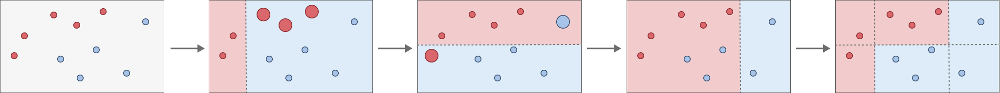

# Ensemble Tree Models
An **ensemble method** is an approach which combines simple “building-block” models (aka weak learners) to create a more complex model with much greater performance than the simple models. 

A decision tree model is an example of a weak learner, it’s main disadvantages are that:

* A single feature is chosen as root node, which affects the entire tree (due to the top-down approach)
* Depending on the splitting criteria some features may not be used at all
* Susceptible to overfitting of data

## Bagging
A decision tree model suffers from high variance; if the training data is split into two batches the predictions will vary substantially between the two resulting models. Bagging (aka bootstrap aggregation) is a general-purpose procedure for reducing the variance of a weaker model. 

The general bootstrap approach aims to reduce the variance of a quantity $x$ by using multiple measurements of $x$ and taking the average. The variance of the mean of x is inversely proportional to the number of measurements.

$$Var(\bar x) = \frac{\sigma^2}{n}$$

In the bagging method this idea is applied to the prediction model. Normally the prediction $y$ is obtained directly from a function $f(X)$ with the feature data $X$ as argument, in this method the prediction $y$ is instead obtained by building separate prediction models for each training set $f_i(x)$ and taking the average resulting predictions

$$ \hat y=\frac{1}{N_B}f_i(x_i) $$

In practice multiple training sets are often not available, instead the bootstrap approach is used, where $N_B$ number of data sets are sampled from the training data set with replacement. For each bootstrapped data set a model is $f_i^*(x_i)$ is trained, and again the average of all of these is taken. 

$$ \hat y_{bag}=\frac{1}{N_B}f_i(x_i) $$

The resulting trees are deep and not pruned, resulting in high variance. In case of regression trees the results are averaged out across hundreds or thousands of trees, giving strong results. In the case of classification trees the most commonly occurring class is chosen. 

### OOB Error
In general, when using cross-validation part of the data is used for training the model, and part of the data is used for testing the model. This way there is no data leakage: the error is computed based on an observation $y_i$ and a prediction $\hat y_i$ where the prediction is not based on the observation $y_i$.

When using the bagging approach it can be shown that each bagged tree uses approximately ⅔ of the observations, the remaining ⅓ is referred to as out-of-bag (OOB). This is analogous to the hold-out data set in cross-validation. 

If there are $N_B$ number of sampled data sets using the bootstrap method, that means that for the $i^{th}$  observation $y_i$ there are $\frac{1}{3} N_B$ bagged tree models that result in a prediction $\hat y_i$ that is based on the observation $y_i$. 

The OOB response/prediction for the ith observation (i.e. predictions based on out-of-bag data) can be calculated by taking the average predicted response for these 13NB decision trees. Using these predictions and observations the OOB MSE or error rate can be calculated for regression and classification trees respectively. 

### Variable Importance
One advantage of a decision tree is that you can visualize the model easily (model interpretability), once you apply the bagging approach you are dealing with hundreds or thousands of trees, you sacrifice interpretability for accuracy.  

A visualization of the model may no longer be possible, but one can visualize how much each feature contributes on average to the predictions, this is called variable importance. The metric used is the decrease of the “error” (RSS for regression trees or node purity for classification trees) due to a split over a given feature, averaged over all $N_B$ number of trees. 

  

In the graph above the Gini Index reduction (averaged out over NB number of trees) for each feature is shown relative to the Gini Index reduction of the Thal feature, indicating that Thal, Ca, and Chest Pain are the most important  variables (features). 

### Limitations

In the bagging approach a number of decision trees are created using bootstrapped training samples. The way each tree is constructed is through the use of the recursive binary split method. This method chooses which feature to split such that the RSS value is minimized. 

The downside of this approach is that if there is one strong predictor along with a number of other moderately strong predictors, then the recursive binary split method will split nodes in a very similar fashion across trees, resulting in a set of highly correlated trees. 

If one takes the average prediction from many correlated/similar trees, then the effect of the bootstrap effect is neglected; the reduction of the variance will be limited. 

## Random Forest

In the random forest approach a number of decision trees are created using bootstrapped training samples, similar to the bagging approach. However in order to avoid having many similar/correlated trees, for each node the split may only occur on a random subset of features $m$ from the total features $p$.  If there is a single strong predictor, then there is a $(p-m)/p$ chance that this predictor is not used for a given split at a node when constructing the tree. 

### Number of Estimators
In general you can choose as many estimators (number of trees) as you wish as the model is fast, and does not overfit. The reason no overfitting occurs is that each tree is composed of a subset of the data, and there are only so many possible unique combinations of the data. At some point trees become correlated because they are based on very similar data, and thus provide very similar predictions. In general $N$=100 is a good starting point

### Number of Subset Features
When a split at a node occurs only a random subset of features $m$ are taken into account. When $m=p$, each subset is simply the entire feature set, resulting simply in bagging. It turns out that  $m \approx \sqrt(p)$ or $m \approx \frac{p}{3}$ typically results in good predictions. 

  

## Adaptive Boosting
Adaptive Boosting (AdaBoosting) is a meta. It uses a series of weak learners (simplistic models) and combines them through a weighted sum. Each new model in the sum is based on the previous tree in the sum, making the model “adaptive”. 

### Algorithm
A set of predictions $y$ can be approximated using a very simple model $\hat h_0$, which will result in a set of residuals $r_0$ 

$$ y \approx \hat h_0 + r_0$$

An additional model $\hat h_1$ can be introduced which aims to improve the total predictions, where the parameter $\lambda_1$ is chosen such that the new residuals $r_0$ are minimized. 

$$ y \approx \hat h_0 + \lambda_1 \hat h_1 + r_0 $$

The final predictor $\hat y_m$ is thus a linear sum of weak learners consisting of $m$ sub-models

$$ \hat y_m = \sum_{n=1}^{m} \lambda_n \hat h_n $$

The parameter $\lambda_n$ is chosen such that the error of the weak learner $\hat h_n$ is minimized. This is done by assigning weights to the misclassified data points, and fits the next weak learner on this. 

  

The complexity of each weak learner $\hat h$ can be controlled. For tree based methods this parameter is $d$ and controls the number of splits ($d$ + 1 leaf nodes). This controls the interaction depth of the model. Often $d$ = 1 will work just fine, which is simple a tree stump (one root node and two leaf nodes). 

### Loss Function - Classification

When training the next model in the linear combination the previous linear combination is taken and an additional weak learner is added

$$ \hat y_m = \hat y_{m-1} + \lambda_m \hat h_m $$

<!-- $$ \hat y_{m-1} = \sum_{n=1}^{m-1} \lambda_n \hat h_n$$ -->

In order to strongly punish incorrect classifications, an [exponential loss function](https://en.wikipedia.org/wiki/Loss_functions_for_classification) is used in the algorithm. For a prediction model $\hat y_m$ which has $m$ sub-models, the loss function is given by

$$ E_m = \sum_i e^{-y_i \hat y_{m,i}} $$

$$ E_m = \sum_i e^{-y_i \cdot (\hat y_{m-1, i} + \lambda_m \hat h_{m,i})} = \sum_{i} e^{-y_i \cdot \hat y_{m-1,i}} \cdot e^{-y_i \cdot \lambda_m \hat h_m} $$

The parameter $\lambda_m$ is chosen such that, after training the weak learner $\hat h_m$, the error $E_m$ is minimized. As the first exponent is independent of parameter $\lambda_m$, it can be denoted as a "weight" $w_{m,i}$

$$ w_{m,i} =  e^{-y_i \cdot \hat y_{m-1, i}} $$

$$ E_m = \sum_{i} w_{m,i} \cdot e^{-y_i \cdot \lambda_m \hat h_m} $$

The summation can be split into two, one for data points that are correctly classified ($y_i = \hat h_{m,i}$), and one for data points that re incorrectly classified ($y_i \neq \hat h_{m, i}$). For correct classifications $y_i$ and $h_{m,i}$ will always have the same sign, resulting in a value of +1. Similarly for incorrect classifications always results in a value of -1. 

$$ E_m = \sum_{i; y_i = \hat h_{m,i}} w_{m,i} \cdot e^{- \lambda_m} + \sum_{i;y_i \neq \hat h_{m,i}} w_{m,i} \cdot e^{\lambda_m} $$

The exponents are now independent of $i$ and therefore no longer contribute to the summations. The summations now represent the sum of weights for the correctly and incorrectly (not-correct) classified predictions. 

$$ E_m = W_{m,c}\cdot e^{-\lambda_m} + W_{m,nc} \cdot e^{\lambda_m}$$

This expression can be rewritten

$$  e^{\lambda_m}E_m = W_{m,c}\cdot + W_{m,nc} \cdot e^{2\lambda_m}$$

$$  e^{\lambda_m}E_m = W_{m,c}\cdot + W_{m,nc}  + W_{m,nc} (e^{2\lambda_m} -1)$$

$$  e^{\lambda_m}E_m = W_m  + W_{m,nc} (e^{2\lambda_m} -1)$$

The value of the parameter $\lambda_m$ can be found by minimizing the  total error $E_m$, which can be done by setting the partial derrivative equal to zero. 

$$ \frac{\partial E_m}{\partial \lambda_m} =0$$

This results in a values for $\lambda_m$ of

$$ \lambda_m = \frac{1}{2} \ln (\frac{W_m - W_{m,nc}}{W_{m,nc}})$$

$$ \lambda_m = \frac{1}{2} \ln (\frac{1-\epsilon_m}{\epsilon_m})$$

$$ \epsilon_m = \frac{W_{m, nc}}{W_m} $$

The parameter $\lambda_m$ is therefore governed by the ratio of the sum of incorrect weights $W_{m,nc} to the sum of all the weights $W_m$. Here the weights represent the error terms of the previous ($m$ - 1) model

$$ W_m = \sum_i w_{m,i} =\sum_i e^{-y_i \cdot \hat y_{m-1, i}} = E_{m-1} $$

 

### Boosting vs Bagging
Similar to bagging, boosting is a general approach that may be applied to various statistical models for both classification and regression. 

Bagging and random forest methods utilize many different versions of the same data set, sampled in different ways, where trees of similar complexity fitted on these subsets of the dataset are combined in order to give the final prediction. 

The boosting method does not use subsets, but utilizes the entire data set. It combines trees of increasing complexity until the desired degree of accuracy is obtained. 
