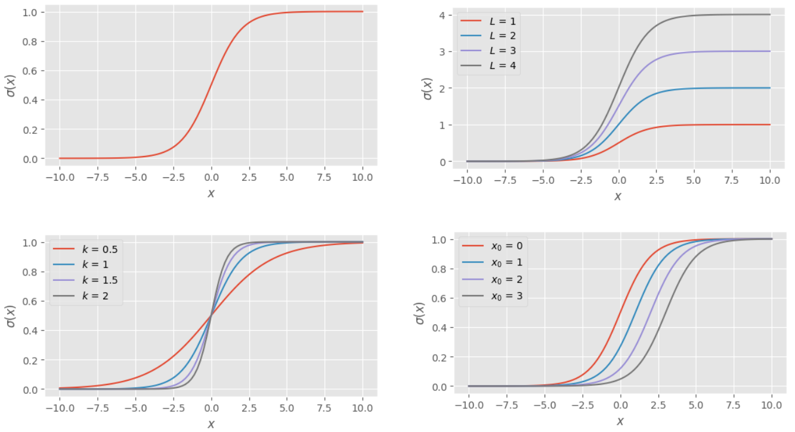
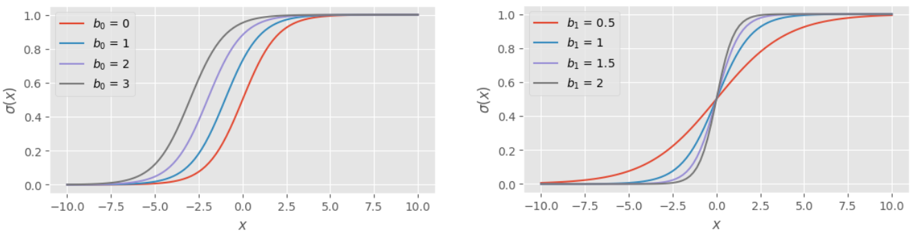
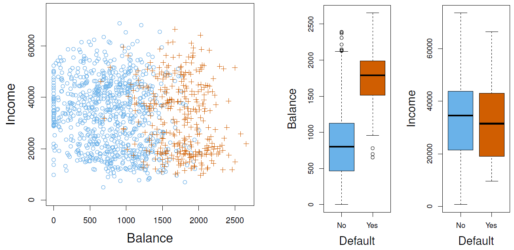
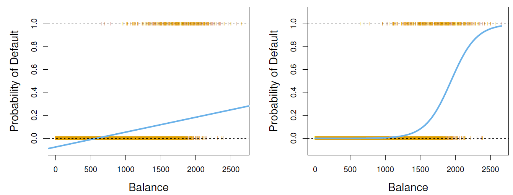
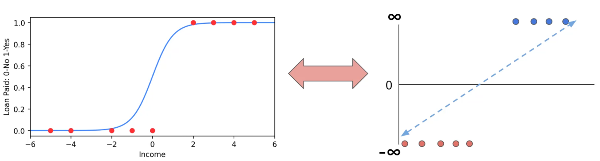
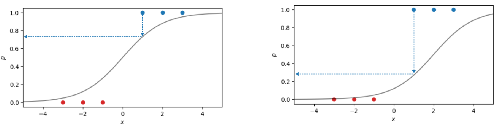
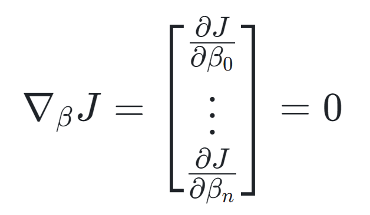

# Logistic Regression
Logistic regression is a simple classification model based on the logistic function. 

## Logistic Function
### Generalized Logistic Function
Logistic regression transforms a Linear Regression into a classification model through the use of the logistic function. The generalized logistic function is in the form of:

$$ \sigma(x) = \frac{L}{1+e^{-k(x-x_0)}}$$

**Where**  
$L$ = Height of the logistic function  
$k$ = Steepness of the logistic function  
$x_0$ = Location of the logistic function  

  

### Probability Logistic Function
We can use a specific version of the generalized logistic function to describe the probability of something occurring. In this case the value of $L$ will be equal to 1 as the maximum of the value should be 1/1. 

$$ p(x) = P(X = x) = \frac{1}{1+e^{-(\beta_0 + \beta_1 x)}} $$

**Where**  
$\beta_0$ = Shifts the logistic function sideways  
$\beta_1$ = Increases the steepness of the logistic function

  

## Binary Logistic Regression
The following data set shows the balance & income of the credit card holders, and whether or not they defaulted on their payments. There seems to be a strong correlation between the credit card holder's balance and whether or not they will default (center plot below).

  

If linear regression is applied (left plot below) then the prediction model will perform quite poorly. However using the logistic function it is possible to predict the probability of default given a certain balance (right plot below).

$$ p(X) = P(y = 1  | x = X) = \frac{1}{1+e^{-(\beta_0 + \beta_1 X)}}$$

**Where**  
$y$ = default on payment (0 = "no", 1 = "yes")  
$X$ = credit card balance

  

### Odds
In betting the term odds is often used, which from a statistics point of view represents the ratio of the probability of an event occurring to the probability of an event not occurring.

$$ odds = \frac{p}{1-p} $$ 

If this is applied to the [probability logistic function](#probability-logistic-function) then a linear relationship can be obtained between the feature X and the natural log of the odds (a.k.a. log odds or logit)

$$ odds = \frac{p}{1-p} = e^{-(\beta_0 + \beta_1 X)}$$ 

$$ \ln (\frac{p}{1-p}) = \beta_0 + \beta_1 X $$

Although the relationship between the log odds and the feature $X$ is linear, the relationship between the probability of defaulting on a loan $p(X)$  and $X$ is not linear. This means that the slope coefficient $β_1$  does not correspond to a change in $p$ due to a one-unit increment of $X$

$$ β_1≠ \frac{Δp}{ΔX} $$

In addition, when considering probabilities close to 1 or close to 0, the log odds value will tend towards positive and negative infinity respectively. 

  

<!-- TODO: add link to least squares -->
As a result the regular least squares method cannot be used. Non-linear least squares method could be used, but the general maximum likelihood approach is preferred. 

## Maximum Likelihood
When fitting a machine learning model the parameters are chosen such that the model fits the best to the data. In the case of linear regression the quality of the fit depends on how far away the training data points are from the predictions, measured by the RSS. 

In the case of logistic regression the model does not describe data measurements, but probabilities. As a result the likelihood of all the training data points occurring given the prediction model can be determined. 

Consider two fits, fit 1 being a good fit (left plot below) and fit 2 being a poor fit (right plot below). For each data point the probability that it occurs according to the fit can be determined. It can be seen that although the red points in fit 2 have a large probability of occurring, the blue data points are not likely to occur, making it a poor fit. 
<!-- 
| $X$ | $y$ | $\hat y_1$| $\hat y_2$ |
|---|---|---|---|
|-3 | 0 | 0.05 | 0.01 |
|-2 | 0 | 0.12 | 0.02 |
|-1 | 0 | 0.27 | 0.05 |
|1 | 1 | 0.73 | 0.27 |
|2 | 1 | 0.88 | 0.50 |
|3 | 1 | 0.95 | 0.73 | -->

  

The likelihood of a dataset corresponding to a given fit/prediction can be determined by multiplying all the probabilities of each data point together.

$$ \mathcal{L} = \prod \hat p_{y=1}(X)  \times \prod \hat (1 - p_{y=0}(X)) $$

with

$$ \hat p (X) = \frac{1}{1+e^{-(\beta_0 + \beta_1 X)}} $$

**Where**  
$\hat p_{y=1} = P(x=X, y=1)$  
$\hat p_{y=0} = P(x=X, y=0)$ 

### Cost Function
<!-- TODO: Add links to linear regression and gradient descent -->
Similar to Linear Regression, a cost function can be defined which is then minimized using gradient descent. 

<!-- matrix in markdown not yet supported :( ) -->
<!-- $$ \nabla_{\beta} J = 
\begin{bmatrix}
    \frac{\partial J}{\partial \beta_0} \\
    \vdots \\
    \frac{\partial J}{\partial \beta_n} 
\end{bmatrix} 
= 0$$ -->

  

Allowing the cost function $J$ to be the natural log of the negative likelihood $\mathcal{L}$ allows the multiplication terms to be turned into summation terms.

$$ \ln(a\cdot b) = \ln (a) + \ln(b)$$

$$ \prod \hat p_{y=1}(X)  = \sum \ln (\hat p_{y=1}(X)) $$

The gradient descent method minimizes the cost function J (as the name suggests), so the negative natural log of the likelihood L is taken.

$$ J(\beta) = -\ln(\mathcal{L})$$
$$ J(\beta) = - (\sum \ln (\hat p_{y=1}(X)) + \sum \ln (1 - \hat p_{y=0}(X))$$

In the loss function above, the data set needs to be subdivided into 2 subsets, First all the data points where $y$ = 1 are considered.

$$\sum \ln (\hat p_{y=1}(X))$$

Then all of the data points where $y$ = 0 are considered

 $$\sum \ln (1 - \hat p_{y=0}(X)) $$

However, by recognizing that the values of $y$ will only ever be 1 or 0, a mathematical trick may be used.

$$ J(\beta) = - \sum (y \cdot \ln (\hat p) + (1-y) \cdot \ln (1 - \hat p))$$

If $y$=1 then the first term of the summation will be $\ln⁡(\hat p)$  and the second term zero, and vice versa if $y$=0 then the first term in the summation will be zero, and the second term will be $\ln⁡(1−\hat p)$     
