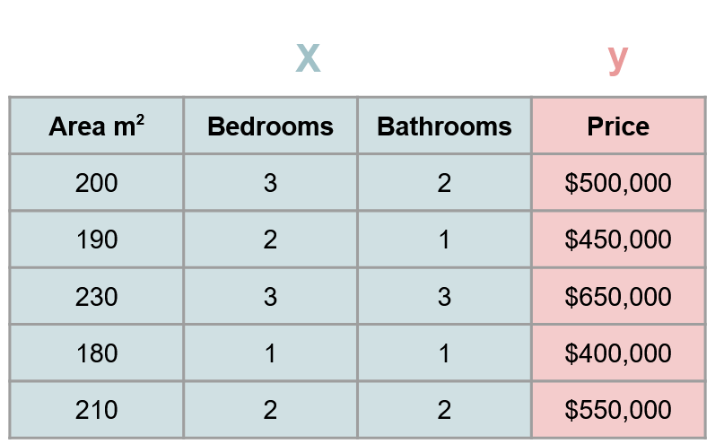

# Statistical Learning
Any machine learning model is based on the same principle: trying to make predictions based on a data set. For example a data set for house prices might look as follows.

  

Here $X$ represents the features (variables/parameters describing the house) that are used to predict the house price $y$. In reality the prices y will be related to the features $X$ through some function $f(X)$, plus an uncertainty term $ϵ$

$$y=f(X)+ϵ$$

Using statistical learning various models can be deployed in order to predict $y$ based on a approximating $f(X)$

$$ \hat y \approx f(X) $$

The error of this approximation can be represented by calculating the expected value of the difference between the predicted and actual values of y

<!-- $$ E[(y−y ̂ )^2 ]=E[(f(X)+ϵ−f ̂(X))^2 ]=(f(X)−f ̂(X))^2+"Var"(ϵ)  -->

$$ E[(y - \hat y)^2] =  E[(f(X) +\epsilon -  \hat f(X) )^2] = (f(X) - \hat f(X))^2 + Var(\epsilon)$$

The first term in the expression above represents the error due to the chosen model (**reducible error**), the second term represents the error due to uncertainties that cannot be controlled (**irreducible error**). 

The irreducible error arises because y might be a function of other variables than the features provided in the data set. Some things are so complex they might as well be random, for example: the risk of an adverse reaction might vary for a given patient on a given day, depending on manufacturing variation in the drug itself or the patient’s general feeling of well-being on that day.