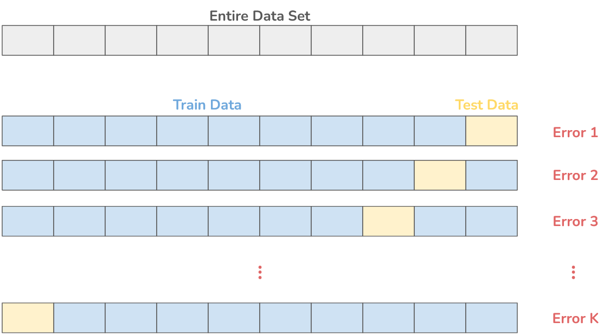
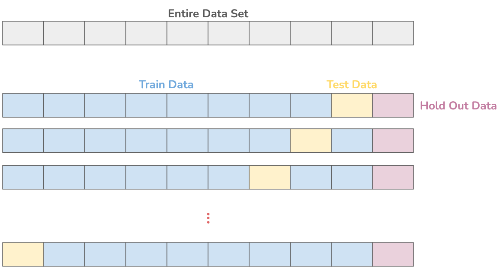
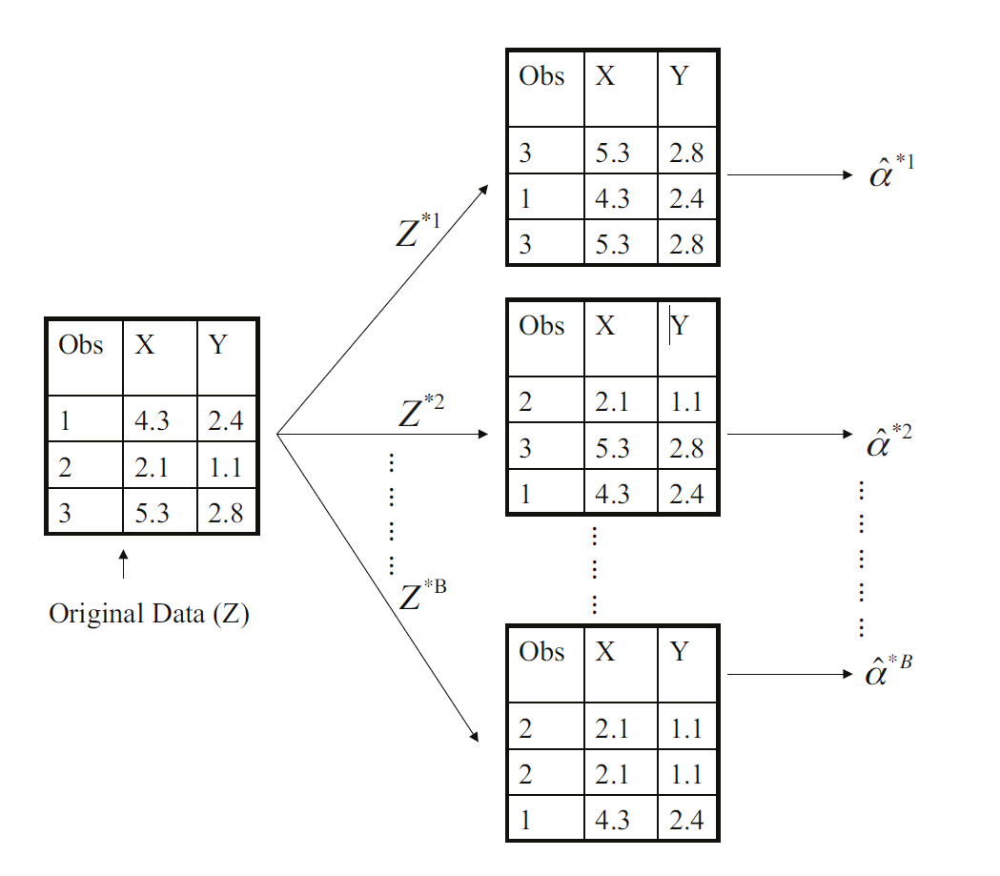

# Resampling Methods
In order to check the performance of the model part of the data should be used for some sort of validation. 

## Cross-Validation

When forming predictions using Machine Learning algorithms, the accuracy of the predictions is estimated by training on the model on training data and testing the model using test data. However by performing the train-test-split operation part of the data set is sacrificed for testing purposes.
 
As a result the **hyperparameters** (parameters of machine learning model that can be tweaked during analysis) cannot be tuned to the entire dataset.
 
Cross Validation allows one to train on the entire data set and test the entire data set.

### K-Fold Cross-Validation
One of the most common cross-validation methods is the K-fold cross-validation where the entire dataset is split into K equal parts. Each time one part is considered the test data and all the other parts are the train data.
 
If this is repeated for all K parts, the mean error can be calculated. This way the entire data set is taken into account for training and testing.

  

The most common choice is $k$ = 10  
The most accurate choice is $k$ = $N$, where $N$ is the number of rows in the data set

### Hold-Out Test Data
The problem with tuning the hyperparameters of the machine learning model is that the user (data scientist) uses the results of the test-data performance (error) to create the prediction model.
 
This is a form of indirect data leakage, the algorithm itself does not take any information from the test data to the train data, but the user does if they tune the hyperparameters.
 
The solution is to separate the data set into train data, test data, and hold-out data. Cross-validation may be applied to different combinations of test and train data, but the hold-out data remains unchanged and unseen. After testing the hold-out data no more hyperparameter changes are allowed to be made.

  

## Bootstrap

### Law of Large Numbers

Consider a feature $X$ which has a true/population size $N$, true/population mean $\mu$, and true/population standard deviation $\sigma$. 

$$ \sigma = \sqrt{\frac{1}{N}\sum(x_i - \mu)^2}$$

If $n$ observations are sampled from the population in the form of $x_1$, $x_2$, ... , $x_n$, then the sample mean $\bar x$  is given by 

$$\bar x = \frac{1}{n}(x_1+x_2+ ... +x_n)$$

The sample mean $\bar x$ will most likely not be the same as the true/population mean $\mu$, how much this varies can be described by the standard deviation $\sigma_{\bar x}$  of the sample mean $x$, also known as the **standard error**

$$Var(x)=Var( \frac{1}{n}(x_1 + x_2 + ... + x_n) ) = \frac{1}{n^2}( Var(x_1)+Var(x_2)+ ... +Var(x_n) ) = \frac{n \sigma^2}{n^2} = \frac{\sigma^2}{n} $$

$$ \sigma_{\bar x} = \sqrt{Var(\bar x)} = \frac{\sigma}{\sqrt{n}} $$

This shows that the larger your sample size $n$, the smaller the standard error $\sigma_{\bar x}$, the less the sample mean will vary from the true mean. 

### Bootstrap Method
Consider trying to make a single prediction in the form of a value $\alpha$ based on a dataset with various features $X$ containing $$ data points. We could measure the accuracy of the prediction $\alpha$ by repeatedly running the statistical model $N_B$ number of times. Each time the model is run with a different dataset $X_i$ containing different data points, resulting in a different prediction $\alpha_i$. The sample mean of $\bar \alpha$ after $N_B$ runs would then be given by 

$$ \alpha_i = \alpha(X_i) $$

$$ \bar \alpha = \frac{1}{N_B}\sum \alpha_i $$

The standard error then provides the standard deviation of the sample mean $\bar \alpha$

$$ \sigma_{\bar \alpha} = \frac{\sigma_{\alpha}}{\sqrt{N_B}} $$

In order to make a good prediction for $\alpha_i$ there should be sufficient n number of data points, which would mean the data set should contain a total of at least $n \times N_B$ number of data points. Unfortunately in practice the data sets are limited in size and the aforementioned method may not work. 

The bootstrap method utilizes sampling of the total data set with replacement, which means that a data set $X_i$ will still contain $n$ observations, but may consist of data points occurring more than once. 

  

