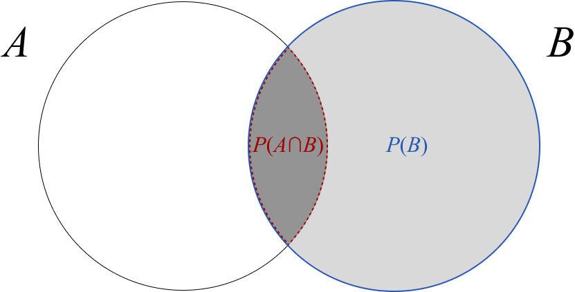

# Natural Language Processing

## Bayes Theorem
In set theory the probability of an event $A$ occuring given that event $B$ occured can be described as the ratio of the probability of $A$ and $B$ occuring (intersect) and the probability of $B$ occuring

$$ P(A|B) = \frac{P(A \cap B)}{P(B)} $$

$$ P(B|A) = \frac{P(B \cap A)}{P(A)} $$

  

Since the intersect of $A$ and $B$ is the same as the intersect of $B$ and $A$, Bayes Theorem may be rewritten as

$$ P(A \cap B) = P(B \cap A) $$

$$ P(A|B)P(B) = P(B|A)P(A) $$

$$ P(A|B) = \frac{P(B|A)P(A)}{P(B)} $$

### Example
There is a building with  faulty smoke alarm that only goes off 10% of the time. The question then becomes, *if you hear the smoke alarm go off, what is the probability there is a dangerous fire*?

In a fire situation the following probabilities are known
* Dangerous fire = 1%
* Smoke alarm goes off = 10%
* Smoke alarm goes off during dangerous fire= 95%

 

$S$ = smoke alarm goes off  
$F$ = dangerous fire  

$$P(F|S) = \frac{P(S|F)P(F)}{P(S)} = \frac{0.95 \cdot 0.01}{0.1} = 9.5\% $$

## Naive Bayes Classifier
When performing any sort of classification, you are asking the question: Given a set of data points $X$ what is the probability the label should be classified as class $c_m$

<!-- $$ P(c_m | X) = P(c_m| x_1, x_2, ... , x_n)$$ -->

$$ P(c_m | X) = \frac{P(X|c_m)P(c_m)}{P(X)} = \frac{P(x_1, x_2, ..., x_n|c_m)P(c_m)}{P(X)} $$

The dataset $X$ is a series of datapoints $x_i$, if we make the **naive assumption** that all the data point in $X$ are *independent* of one another, then we can rewrite the above probability as

$$ P(X | c_m) = P(x_1 |c_m ) \cdot P(x_2 | c_m) \cdot ... \cdot P(x_n | c_m) $$

$$ P(c_m | X) =  \frac{(P(x_1 |c_m ) \cdot P(x_2 | c_m) \cdot ... \cdot P(x_n | c_m))P(c_m)}{P(x_1, x_2, ... x_n)} $$

The final classification will be the value of $c_m$ which produces the largest value for said probability. In other words you could loop over every possible class $c_m$ and check what the probability is. For each value of $c_m$ the denumerator remains the same, so in order to find the correct class classification $c_m$, the following expression needs to be maximized. 

$$ P(c_m) \prod_{i=1}^n P(x_i | c_m) $$

## Multinomial Naive Bayes

There are many types of Naive Bayes classifiers, however in the context of Natural Language Processing, the Multinomial Naive Bayes classifier is the most common. To illustrate how this works consider a machine learning model which aims to classify movie reviews as *positive* or *negative* based on the text of the review. 

For this example we consider 35 reviews, 25 of which are positive, and 10 are negative. The word counts of important words have been gathered. 

||Positive Review|Negative Review|
|--|--|--|
|"movie"|10|8|
|"actor"|2|10|
|"great"|8|0|
|"film"|4|2|

### Data Preparation

For the classification the following expression needs to be maximized

$$ P(c_m) \prod_{i=1}^n P(x_i | c_m) $$

The probability of a movie belonging to either class can quite simply be calculated. 

$P(\textrm{pos}) = 25/35 = 0.71$

$P(\textrm{neg}) = 10/35 = 0.29$

Next the probabilities of getting a word $x_i$ given a classification $c_m$ are calculated

|$x_i$| $P(x_i\| \textrm{pos})$ | $P(x_i\| \textrm{neg})$ |
|--|--|--|
|"movie"|10/24 = 0.42|8/20 = 0.4|
|"actor"|2/24 = 0.08|10/20 = 0.5|
|"great"|8/24 = 0.33|0/20 = 0|
|"film"|4/24 = 0.17|2/20 = 0.1|

### Classification
This new data can then be used in order to determine whether a new review is positive or negative. Consider the review of "movie actor", the probability that it belongs to a positive review is proportional to:

$P(\textrm{pos}) \cdot P(\textrm{"movie"}|\textrm{pos}) \cdot P(\textrm{"actor"}|\textrm{pos}) =0.71(0.42)(0.08) = 0.024$

Similarly, the probability that the review belongs to a negative review is proportional to 

$P(\textrm{neg}) \cdot P(\textrm{"movie"}|\textrm{neg}) \cdot P(\textrm{"actor"}|\textrm{neg}) =0.29(0.4)(0.5) = 0.058$

The movie review is therefore a lot more likely to be negative than positive, mainly because (according to the training data set) negative reviews talk about actors a lot more than positive reviews. 

### Smoothing Factor
One may run into problems if one of the word counts $x_k$ is zero, then the entire probability will be zero.  

$$P(x_k |c_m) = 0$$

$$ P(c_m) \prod_{i=1}^n P(x_i | c_m) = 0$$

For example the review "*I had great seats but the movie was horrendous*" will have a zero chance of being a negative review because the word count for "great" in the negative reviews section of the training data is zero. 

$P(\textrm{neg}) \cdot P(\textrm{"movie"}|\textrm{neg}) \cdot P(\textrm{"great"}|\textrm{neg}) = 0$

To remedy this a smoothing factor $ \alpha$ may be applied, which simply increases the word count 

||Positive Review|Negative Review|
|--|--|--|
|"movie"| $10 + \alpha $|8 + $ \alpha$|
|"actor"|2 + $ \alpha$|10 + $ \alpha$|
|"great"|8 + $ \alpha$|0 + $ \alpha$|
|"film"|4 + $ \alpha$|2 + $ \alpha$|

## Feature Extraction
Most machine learning algorithms don't have raw text data is input, instead it needs to be converted into numerical data. 
