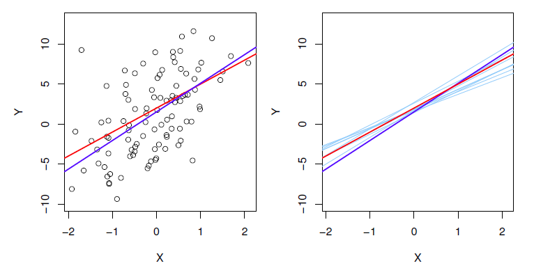

# Evaluating Regression

It is important to evaluate how well a prediction model approximates a set of data. This section focuses on regression models, dealing with continuous features. 

## Accuracy of Fit
The accuracy of the fit can be measured by a metric describing the accuracy of the model as a whole for a given data set. 

### Mean Absolute Error (MAE)
As the name suggests the *Mean Absolute Error* takes the absolute value of the residual (error) and averages it out over the entire data set of length $n$

$$ MAE = \frac{1}{n} \sum_{i=1}^{n} |y_i - \hat y_i| $$
								

|Pro|Con|
|-|-|
|Easy to understand/implement|All errors are treated equally|
|Error units same as data||

### Mean Squared Error (MSE)
Larger errors are punished more than with MAE by squaring the residual (error)

$$ MSE = \frac{1}{n} \sum_{i=1}^{n} (y_i - \hat y_i)^2 $$

|Pro|Con|
|-|-|
|Punishes larger errors more than smaller errors|MSE gives an error in different units than the original data (unintuitive to know how far off you are)|

### Root Mean Squared Error (RMSE)
This punishes the larger errors more than the smaller errors, while keeping the units of the error the same as the units of the data. This is analogous to reporting the standard deviation instead of the variance. 

$$ RMSE = \sqrt{\frac{1}{n} \sum_{i=1}^{n} (y_i - \hat y_i)^2} $$

|Pro|Con|
|-|-|
|Punishes larger errors more than smaller errors|Slightly more computationally expensive (negligible)|
|Error same units as data||					

## Accuracy of Coefficients

When performing a linear regression analysis we are trying to approximate $y$ with $\hat y$. Normally the true relationship $f(X)$ (in case of linear regression this is known as the population regression line) is not known. 

 
However we can simulate a data set with a known population regression line $f(X)$ by generating random values of $X$ and using them to calculate $y$. 

$$ y = f(X) + \epsilon $$
$$ f(X) = 2 + 3X $$
$$\hat y = \beta_0 + \beta_1 X$$

  

**Black Dots** measurements from the data set $y$  
**Red Line** 	true relationship (population regression) $f(X)$  
**Blue-Purple Line**	linear regression fit (least squares line) $\hat y$ based on the black dots data set  
**Light Blue Lines**	linear least square lines $\hat y$ based on separately generated data sets

In the graph above it can be seen that the prediction $\hat y$ (**Blue-Purple Line**) is slightly different than the true relationship $f(X)$ (**Red Line**). 

However if different data sets based on y are generated and linear regression is applied, then it can be seen that the average values of the light blue lines $\hat y$ approximate the true value $f(X)$ quite well. 

### Estimation Bias
Consider a random variable $Y$ with a true mean value of $μ$. If we take a set of measurements, we can compute the sample mean $\hat μ$ in order to estimate the true mean $μ$. Depending on the measurements we will sometimes overestimate the true mean, and sometimes underestimate the true mean, but if we repeat the process enough times and take the average of the sample means, it will converge to the true mean value. 

An estimate is **biased** if the estimate systematically over or underestimates the true value

An estimate is **unbiased**  if the estimate (on average) approximates the true value 

In the case of the simulated data from before it can be seen that the estimated coefficients are unbiased, as the estimates (light blue lines) approximate the true values quite well

### Residual Standard Error (RSE)
Going back to the analogy of the mean value μ of a random variable Y, it is of interest to determine the accuracy of the sample mean μ ̂; how far off do we expect the sample mean μ ̂  to be from the true mean μ
 
Assuming the n observations are uncorrelated, this question is answered through the standard error of the sample mean "SE"(μ ̂ ). This shows us that the standard error of the sample mean decreases with the number of observations n
"SE"(μ ̂ )^2="Var"(μ ̂ )=σ^2/n

"Var"(μ ̂ )="Var"(1/n ∑_(i=1)^n▒Y_i )=1/n^2  ∑_(i=1)^n▒"Var" (Y_i ) =1/n^2  ∑_(i=1)^n▒σ^2 =σ^2/n

Similarly we can determine the standard error of the estimate coefficients β_0  and β_1. 

SE(β_0 )^2=σ^2 [1/n+x ̅^2/(∑▒(x_i−x ̅ )^2 )]                 SE(β_1 )^2=[σ^2/(∑▒(x_i−x ̅ )^2 )]                     σ^2="Var"(ϵ)

In general, σ is not known, but can be estimated from the data through the Residual Standard Error (RSE) which depends on the RSS
