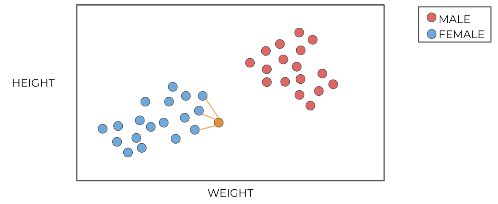
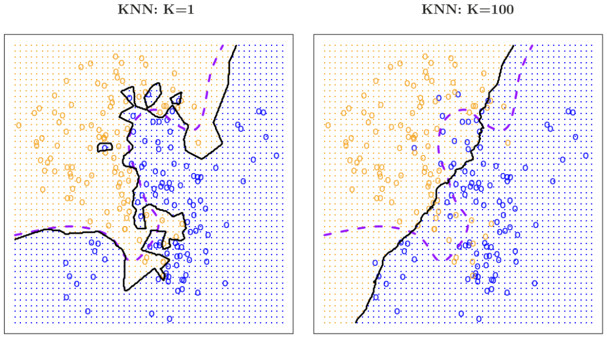
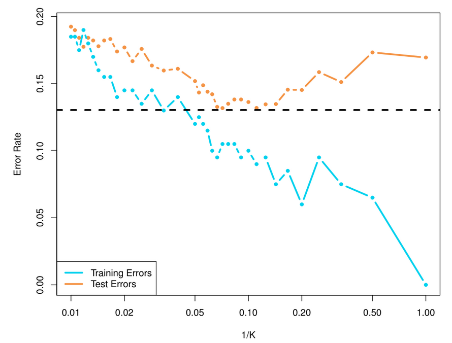
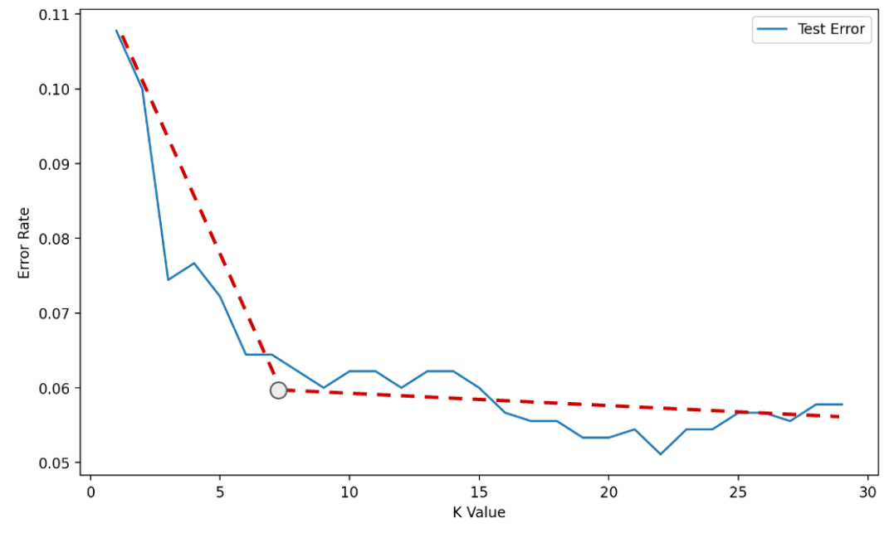

# KNN
The K-Nearest Neighbors is one of the simplest forms of classification. 

## Algorithm
Consider determining the gender of baby chickens, one could try to estimate this based on the height and weight of the baby chicks. Intuitively this estimation can be done by choosing the category closest to the data points.
 
In the case of K Nearest Neighbors this is in the form of choosing the K nearest points and determining the category based on the majority of the data points. 
 

  

In case of a tie there's various options
* Always choose an odd value for K
* Reduce K by 1 until there is no longer a tie
* Randomly choose between the options that are tied
* Choose the category of the point which is closest
 (Scikit Learn)

## Best Value for $K$
The [bias-variance trade-off]() is also applicable to classification methods. If the chosen value of $K$ is very low, then each prediction is based only on a few data points, resulting in very localized behavior. In this case the model is very flexible (high variance). 

If a large value of K is chosen, then the predictions will take too many data points into account, resulting in very generalized behavior. In this case the model is very stiff/inflexible (high bias). 

  

  

To find an appropriate value of $K$ one can use the elbow method, in which the data scientist attempts to identify a value of $K$ where the test error rate does not significantly decrease with increased model stiffness/inflexibility. 

  

However this method is very much based on feeling and cannot be applied everywhere. A more appropriate method is to simply use [cross-validation](). 

### Consideration
* Feature scaling is important
* Slow algorithm
* Choose the right value for K
* There are different ways of measuring distance
    * Minkowski
    * Euclidean
    * Manhattan 
    * Chebyshev
