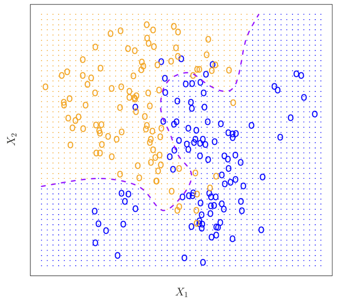

In logistic regression the estimator coefficients are obtained by maximizing the likelihood of the estimations  belonging to the correct category. In other words it tries to maximize the probability that given a training data set  $X_{train}$ what is the probability that label y belongs to a certain class  $c_1$
 
$$P(y=c_1|X=X_{train}) $$
 
In the graph below a set of points with $X_1$ and $X_2$ coordinates are chosen. They have a random chance of belonging to either the orange or blue class, the probability of belonging to either class depends on the location/coordinates of the point. 

The color of the data points represents their true class, the shaded region represents which color a data point falling in said region is most likely to belong to. The dashed purple line represents the **Bayes Decision Boundary**, and represents the line where the probability of belonging to either class is equal.

| | |
|---|---|
|Blue grid region |		$P(y= \text{blue} \|X_1 \cap X_2)>0.5$ |
|Orange grid region |	$P(y= \text{orange} \|X_1 \cap X_2)>0.5$|
|Dashed purple line |	$P(y= \text{blue} \|X_1 \cap X_2)= P(y= \text{orange} \|X_1 \cap X_2)=0.5$|

  

If the predictions y are estimated using the grid shown above, then the error is minimized. This error rate is known as the **Bayes Error Rate**. In this case the algorithm will try to maximize the probability that the estimations y belong to a category c. 

 <!-- $$ \text{max}_c \{ P(y=c|X_{train}) \}$$ -->

 $$
 P(y=c | X_{train})
 $$

The error rate is then given by

 $$1-E[ \text{max}_c P(y=c|X_{train}) ]$$

However in real life the location of the Bayes Decision Boundary is not known, but we can design algorithms that closely approximate it. 
