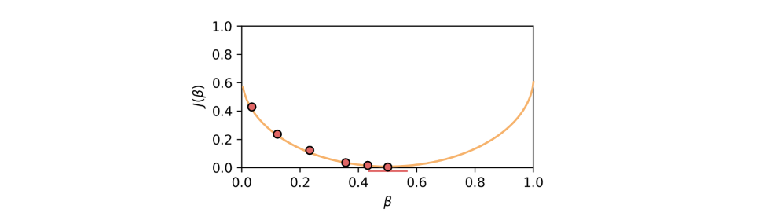
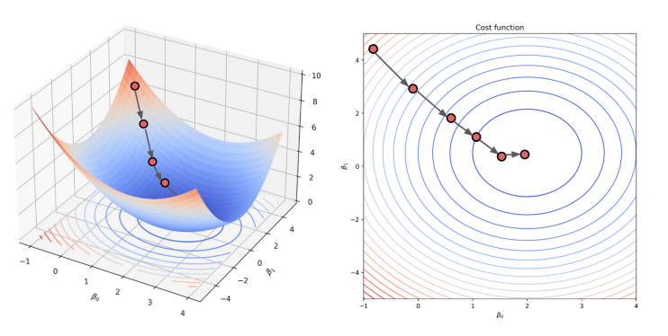
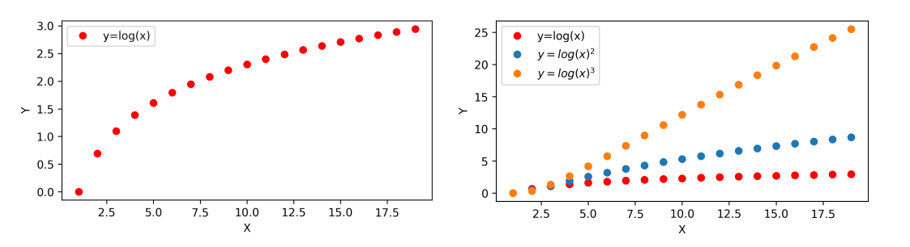

# Linear Regression

Linear regression is a model which assumes that y can be approximated by a linear combination of the features X

$$ 
\hat y = β_0+β_1 X_1+β_2 X_2+…+β_n X_n 
$$

## Ordinary Linear Regression
Ordinary Linear Regression (OLR) or Simple Linear Regression is a very straightforward approach for predicting a quantitative response $\hat y$  based on a single predictor variable $X$

$$ \hat y = β_0+β_1 X$$

### Residual Sum of Squares (RSS)
The error of the model stems from how far the predicted value $\hat y$ is from the true value $y$, this difference is called the residual $e_i$. 

$$
e_i=y_i−\hat y_i $$
            
The **Residual Sum of Squares** (RSS) is a quantity which sums all of the residuals squared and is a measure for the accuracy of the model

$$
RSS=\sum_i^n e_i^2 
$$

### Least Squares Method
In order to estimate the prediction coefficients $β_0$  and $β_1$  **least squares method** may be used. This method uses minimizes RSS value in order to determine $β_0$  and $β_1$.

$$
\hat y = β_0+β_1 X
$$

$$
RSS(β_0, β_1 )  =\sum_i(y_i−(β_0+β_1 x_i))^2    
$$

#### Intercept
$β_0$  is the intercept of the line of $\hat y$ and the $y$-axis	

$$ 
\frac{\partial}{\partial β_0 } RSS(β_0, β_1 )=0	
$$

$$
β_0 = \bar y - β_1 \bar x 
$$

#### Slope
$β_1$  is the slope of the line of $y$ 

$$
\frac{\partial}{\partial β_1} RSS(β_0, β_1 )=0
$$

$$
β_1= \frac{\sum x_i (y_i− \bar y )}{\sum x_i (x_i− \bar x ) }
$$

## Multi Linear Regression
The least squares method can also be used for linear regression with multiple features; in this case $X$ is not a single column, but a collection of columns from a data set $X=[X_1, X_2,...,X_n]$

$$
\hat y =β_0+β_1 X_1+β_2 X_2+…+β_n X_n
$$

A cost function J is formed, which similar to the RSS  takes the squares of the residuals into account. Here $n$ represents the number of features (columns) in the data set, and $m$ the number of observations/measurements (rows)

$$
J(β_0,β_1,…β_n )=\frac{1}{2m} \sum_{j=1}^m(y^{j} − \sum_{i=0}^n \beta_i x_i) 
$$

In order to find the optimal prediction coefficients $β$, the cost function $J$ is minimized by setting its first derivative (with respect to the relevant coefficient $β_i$) equal to zero. If you combine all of these derivatives into a vector, you obtain the gradient $∇_β J$ 

$$
∇_β J=[\frac{∂J}{∂β_0} … \frac{∂J}{∂β_0})]^T=0
$$

### Gradient Decent
For a given value of $β$ the gradient can be calculated using the gradient vector $∇_β J$ . We then take a step in the direction of the negative gradient, and we let the step size be proportional to the magnitude of the gradient. This allows the step size to become smaller the closer we get to the minimum point of the cost function $J $

  

This can be done in 3d in order to show two $β$ values as well. The algorithm also works for more than 2 $β$ values, but cannot be shown visually in the form of a graph
 

  

## Polynomial Regression
In case a feature has a non-linear relationship, it helps to first transform the feature by squaring or cubing said feature. In addition the interaction between two features can be taken into account

  

Feature Conversion
Converting 3 features A, B, and C for example would result in

$$
A,B,C → 1, A, B, C, AB, AC, BC,A^2,B^2,C^2
$$

Where

|Term|Description|
|-|-|
|1	| Bias term, used to calculate y intercept (optional)
|$A, B, C$| Original features
|$AB, BC, CA$| Interaction terms
|$A^2,B^2,C^2$| Higher order terms
