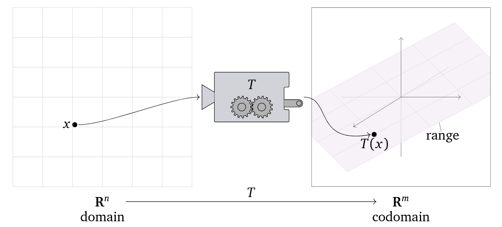

# Principal Component Analysis

## Dimension Reduction

One of the main use cases for the Principal Component Analysis is to reduce the number of features in the training data. If the training data has $p$ features, and a linear regression model is used, then there are $p$+1 estimation coefficients $\beta$ that need to be estimated. 

$$ \hat y = \beta_0 + \sum_{i=1}^p \beta_i X_i$$

A method like regularization achieves some dimensionality reduction by forcing some $\beta$ values to go towards zero. The PCA approach however **transforms** the data into a new set of $k$ number of features, which are fewer than the orginal $p$ features ($k<p$)

$$ \hat y = \alpha_0 + \sum_{m=1}^k \alpha_m Z_m$$

Each new feature $Z_m$ is a **linear combination** of the original features $X_i$

$$Z_m = \sum_j^p \phi_{j,m} X_j $$

## Principal Components
### Linear Transformations
When dealing with multiple dimensions (for example multiple features $X_i$) a linear transformation can be defined. Given a domain $\text{R}^n$ every vector or point in this domain can be transformed to a new domain (codomain) $\text{R}^m$

$$ T: \text{R}^n \rightarrow \text{R}^m$$

  

This transformation $T$ is often a matrix multiplication. For example the transformation of a vector $\bar u$ under $T$ is achieved by multiplying the vector by a transformation matrix $A$. The resulting vector $\bar v$ is the image of $\bar u$ under $T$

$$\bar v = T(\bar u) = A \bar u$$

### Variance

When describing a single feature $X$, the variance is given by the average distance from the mean squared. 

$$\text{Var}(X) = E[ (X - E[X])^2]$$

$$\text{Var}(X) = E[ \Delta_X^2]$$

When there is two variables the covariance is taken into account, as $\text{Var}(X + Y)$ is not the same as $\text{Var}(X) + \text{Var}(y)$

$$ \text{Var}(X + Y) = \text{Var}(X) + \text{Var}(Y) + 2 \text{Cov}(X,Y)$$

$$ \text{Cov}(X,Y) = E[ (X - E[X]) \cdot (Y-E[Y])]$$

$$\text{Cov}(X,Y) = E[ \Delta_X \cdot \Delta_Y]$$

The additional term is the covariance, which is the average value of the product between the distance to the mean for each variable. If $X$ increases when $Y$ increases, then $\Delta_X$ and $\Delta_Y$ will always have the same sign.The coverance can be used to compute the correlation coefficient

$$ \rho(X,Y) = \frac{\text{Cov}(X,Y)}{\sqrt{\text{Var}(X) \text{Var}(Y)}}$$

The covariance matrix 

## Variance

Variance in a data set shows which features $X_i$ influence the label $y$ the most; which features have a large correlation coefficient (e.g. Pearson correlation) with respect to the label. For example, the surface area of a house influence the price a lot more (large correlation factor) than the color of the house (small correlation factor).  

For small data sets this is easy to interpret through a scatter plot, one can easily see if two features are strongly correlated or not. For large data sets we need a tool to determine how much **dispersion** each feature in the data set creates. 

