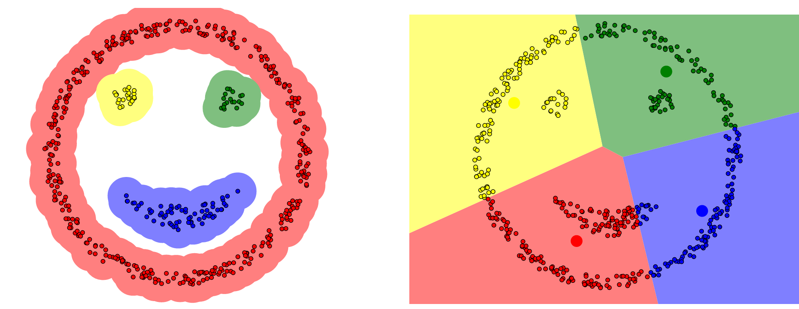
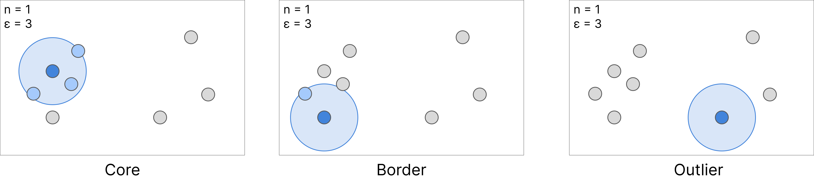
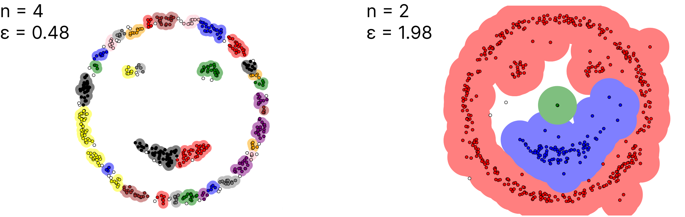
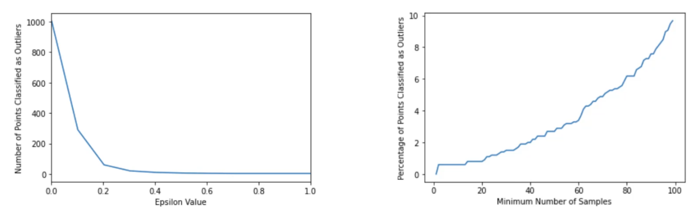

# DBSCAN -  Density Based Spatial Clustering of Application with Noise 
K Means Clustering and Hierarchical Clustering are both distance-based clustering algorithms, which work great if there are simple groupings of points. However for more complex groupings a density based approach works better. 

  

## Point Definitions
During the algorithm each data point is analyzed and can be categorized as 
* Core Point
* Border Point
* Outlier Point

  

Whether a data point is a core, border, or outlier point depends on two hyperparameters of the model: the range $\epsilon$, and the minimum number of points $n$

|Point Type|Definition|
|--|--|
|Core|There are more than $n$ data points within the range $\epsilon$|
|border|There are less than $n$ data points within the range $\epsilon$|
|Outlier|There are no other data points within the range $\epsilon$|

## Hyperparameter
You need to be careful not to use too small of a value for $\epsilon$ or too large a value for $n$ in case the overall dataset has a low density (data points are generally far apart). 

On the other hand an excessively large value for $\epsilon$ or excessively small value for $n$ will make the rules for belonging to a certain cluster too lax. Especially for datasets with a lot of noise it can be easy to cluster outlier data points as part of a certain cluster. 

  

You can play around with the hyperparameters [here](https://www.naftaliharris.com/blog/visualizing-dbscan-clustering/)

### Choosing Hyperparameters
Finding the optimal hyperparameters for any unsupervised learning algorithm is tricky. But a good estimation can be made using elbow plots

  

Increasing the minimum number of clusters can be a good way of identify new smaller clusters instead of classifying them as outliers. 

The right combination of $\epsilon$ and $n$ can be found using domain expertise. 
