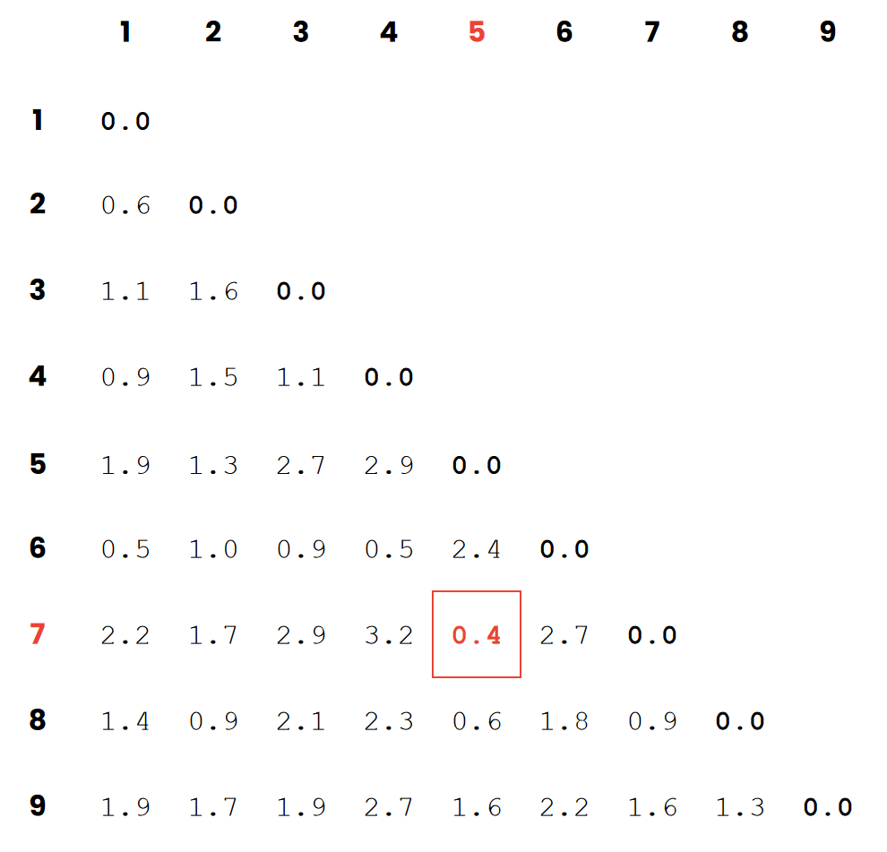
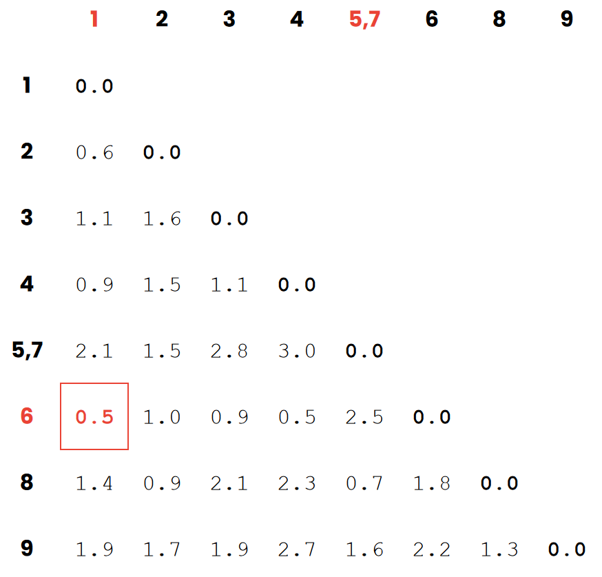
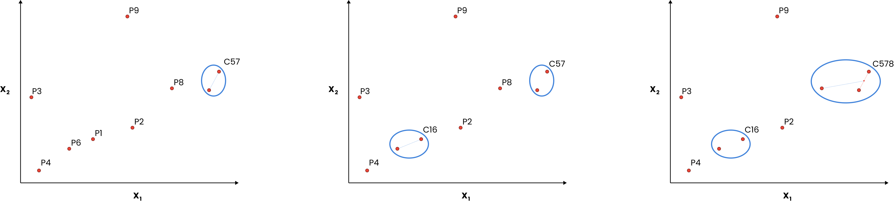
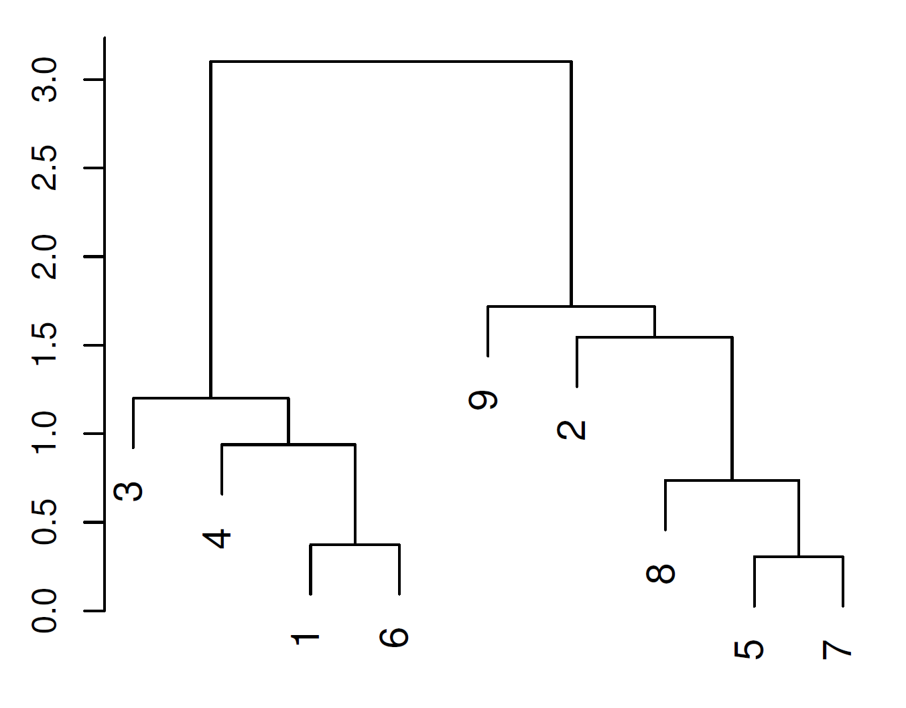
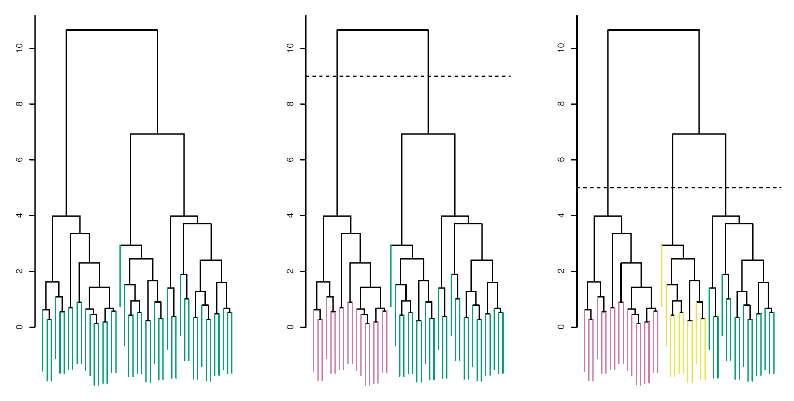

# Hierarchical Clustering

Hierarchical clustering is easy to understand and visualize. One of the main advantages is that you do not have to decide beforehand how many clusters the model is based on. 

## Metrics
### Similarity Metric
In order to determine which data points should be clustered together a "similarity" metric is used. There are various options for this, but a very common one is the Euclidean Distance. This simply computes the distance between two points, the closer the points are together the more similar they are. 

If there are three features $X_1$, $X_2$, and $X_3$, and we wish to find the similarity of two points $A$ and $B$, then the Euclidean Distance $d$ between these points can be calculated. 

$$d_{AB} = \sqrt{(X_{1A} - X_{1B})^2 + (X_{2A} - X_{2B})^2 + (X_{3A} - X_{3B})^2}$$

### Linkage
The Hierarchical Clustering algorithm will merge two data points that are most similar (closest together). The next step is to merge two clusters which are most similar (closest together).The question then becomes, how do we measure the similarity (distance) between two clusters. 

The linkage describes the criterion which is used to determine the similarity between sets of observations or clusters. There exists several options, the one most similar to K Means Clustering is to use the *Centroid Linkage Criterion* which essential computes the distance between the centroid of the two clusters. 

|Linkage|Description|
|---|---|
|Complete|Maximal intercluster dissimilarity: for each data point in cluster A calculate the dissimilarity to each data point in cluster B, use the largest dissimilarity. |
|Single|Minimal intercluster dissimilarity: Maximal intercluster dissimilarity: for each data point in cluster A calculate the dissimilarity to each data point in cluster B, use the largest dissimilarity. [*can result in extended, trailing clusters in which single observations are fused one-at-a-time*]|
|Average|Mean intercluster dissimilarity: for each data point in cluster A calculate the dissimilarity to each data point in cluster B, use the average dissimilarity.|
|Centroid|Calculate the centroid of each cluster and determine the dissimilarity between these two points [*can result in undesirable inversion*]|

## Algorithm
The algorithm works by starting with no groupings, and then fuzing data points together into clusters one step at a time. In each step of the algorithm the (dis)similarity between each point and/or clusters are determined, whichever two objects (two data points, a data point and a cluster, two clusters) are most similar are merged together. 

### Example
Lets take a dataset of 9 data points (rows) and two features $X_1$ and $X_2$ (columns).

  

The first step is to calculate all of the similarities between the different data points, this information can be stored in a **distance matrix**

  

From here we can identify that the points 5 and 7 are most similar (closest) and should therefore by grouped together into a cluster. The previous step is then repeated: the similarity between all data points and clusters is determined and stored

  

This time data points 1 and 6 are closest together and can be fused. After that it is data point P8 and cluster C57. This process is repeated, each time the similarity of each object to all other objects is determined, and the two objects most similar are fused together. 

  

## Dendrogram
In order to visualize the clusters one could plot them out and draw circles around the clusters as shown in the example above. This has two limitations however, first in order to show the steps of the algorithm you will end up drawing a lot of axes next to each other (or drawing a lot of circles on top of each other). Second, if there are more than 3 features, you can no longer plot the data points. 

The solution is to use a dendogram, which shows which data points (horizontal axis) are grouped together, and how they are grouped together (vertical axis). The longer a line on the vertical axis, the more similar two data points and/or clusters are. 

It should be noted that even though the datapoints P9 and P2 appear next to each other in the dendogram, it does not mean the two points are similar. datapoint P9 is only similar to the entire C2857 cluster. 

  

The dendogram can be used to determine how many cluster we want to divide the dataset into. The higher up the cut-off is made, the fewer clusters there are. Ideally you make a cut-off where the connecting lines in the dendogram are longest, as this suggest that the similarity between the clusters is largest (clusters are most distinct from one another).

  

