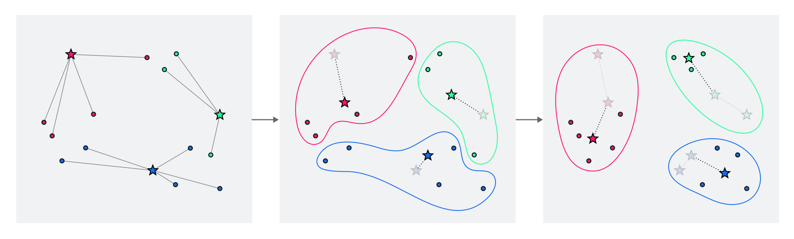
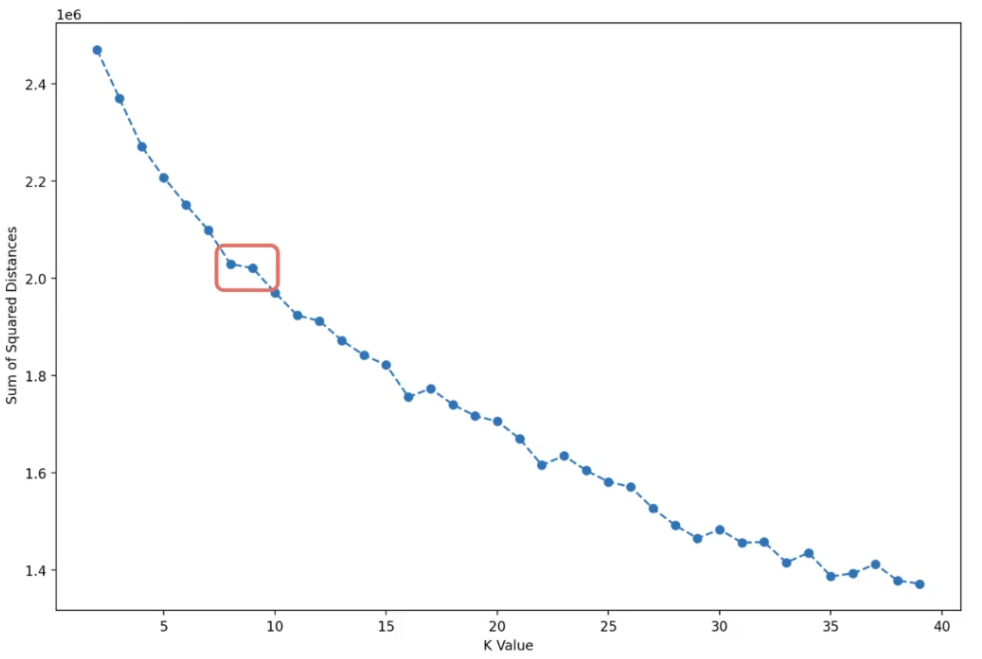

# K-Means Clustering
In the K-Means clustering algorithm the K refers to the chosen number of clusters that the algorithm will attempt to assign the datapoints to. After the clustering process, the datapoints must satisfy the following criteria:
* Each datapoint must be assigned to a cluster (no outliers)
* Each point can only belong to a single cluster

## Algorithm
The K-Means Clustering algorithm is a sequential clustering algorithm in the sense that it is an iterative process that will continue until the cluster assignment no longer changes.
* In each sequence the clusters are defined by a coordinate
* Each data point will be assigned to the cluster whose coordinate point is nearest
* The new coordinate of a cluster is given by the center/centroid of said cluster

  

## Choosing $K$
The effectiveness of a cluster can be expressed by how close each datapoint is to the center coordinate of said cluster. First lets describe each cluster by a set $S_k$ containing $n_k$ datapoints.

$$ S_k = \{x_{p1}, x_{p2}, ... , x_{pn_k}\}$$

The centroid of this cluster can be computed by taking the average of all the datapoints. If the datapoints are multi-dimensional, the same approach can be used: taking the average of all the vectors. 

$$c_k = \frac{1}{|S_k|} \sum_{p \in S_k} x_p$$

The Sum of Square Distances (SSD) will give a measure for how spread out the datapoints belong to a certain cluster are. 

$$\text{SSD} = \sum_i (c_k - x_i)^2$$

By plotting out the SSD value for different values of $K$, one can try to estimate how many clusters one should use. There is no real right answer, but if an increase in $K$ does not lead to a significant decrease in SSD, then that might be a good elbow point to consider. 

There exist multiple elbow points because there might be multiple good ways of splitting up the data set. For example if you have all of the animals on earth in a data set you could cluster them by species, race, size, etc. 

  

